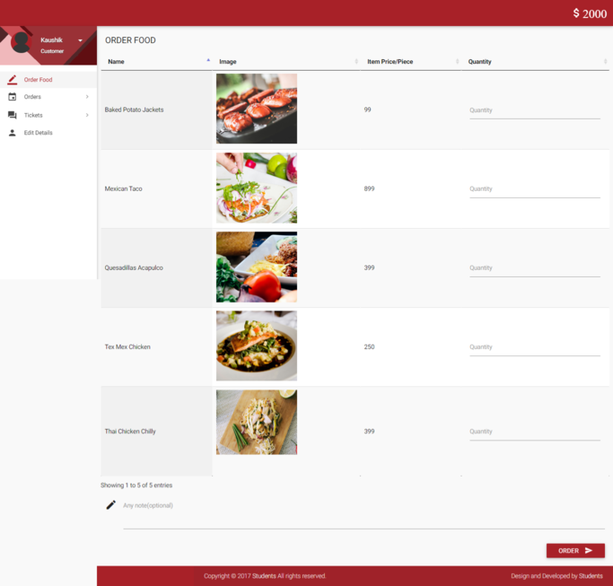
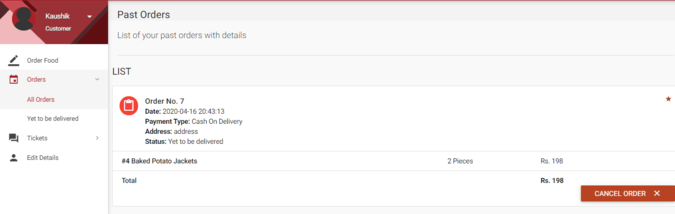
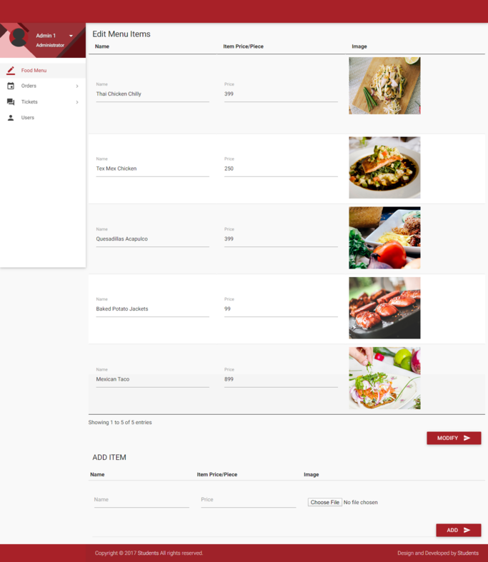

# Overview

This is a web-based Online Food Delivery System built using PHP, HTML, CSS, and JavaScript. The system allows customers to browse menus, place orders, and manage their accounts, while administrators can manage orders, menu items, and user accounts.

## Table of Contents
1. [Installation](#installation)
2. [Login Credentials](#login-credentials)
3. [Features](#features)
4. [Screenshots](#screenshots)
5. [Git Workflow](#git-workflow)
6. [Contributing](#workflow-for-contributors)
7. [License](#license)


## Installation

Follow these steps to set up the project locally:

1. Install XAMPP from [Apache Friends](https://www.apachefriends.org/index.html)
2. Clone the repository to your XAMPP htdocs folder:
   ```bash
   git clone https://github.com/your-username/Online-Food-Delivery-System.git
   cd Online-Food-Delivery-System
   ```
3. Start Apache and MySQL services from XAMPP Control Panel
4. Create a database named `food` in phpMyAdmin
5. Import the food.sql file:
   - Open phpMyAdmin (http://localhost/phpmyadmin)
   - Select the `food` database
   - Click on "Import" tab and select the food.sql file from the project directory
   - Click "Go" to run the SQL script
6. Access the application by navigating to:
   - Customer Interface: http://localhost/Online-Food-Delivery-System/
   - Admin Interface: http://localhost/Online-Food-Delivery-System/account/

## Login Credentials

### Customer Login
- URL: http://localhost/Online-Food-Delivery-System/account/login.php
- Username: user
- Password: Pass@1234

### Admin Login
- URL: http://localhost/Online-Food-Delivery-System/account/login.php
- Username: admin
- Password: Demopass@123

## Features

### Customer Features
- Browse food menu by categories
- View food details and prices
- Add items to cart
- Place and track orders
- Online payment options and Cash on Delivery
- User registration and profile management

### Admin Features
- Order management
- Menu management (add, update, delete food items)
- User management
- Sales reporting
- Support ticket handling

## Screenshots
<details>
   
### Homepage


### Menu Page


### Order Placement


### Admin Dashboard


</details>

## Git Workflow

### Setting Up Git

1. **Install Git**
   - Download and install Git from [git-scm.com](https://git-scm.com/downloads)
   - Verify installation by running `git --version` in terminal/command prompt

2. **Configure Git**
   ```bash
   git config --global user.name "Your Name"
   git config --global user.email "your.email@example.com"
   ```

### Basic Git Commands

1. **Clone Repository**
   ```bash
   git clone https://github.com/username/Online-Food-Delivery-System.git
   ```

2. **Check Status**
   ```bash
   git status
   ```

3. **Pull Latest Changes**
   ```bash
   git pull origin main
   ```

4. **Create New Branch**
   ```bash
   git checkout -b feature/new-feature-name
   ```

5. **Add Changes**
   ```bash
   git add .
   ```

6. **Commit Changes**
   ```bash
   git commit -m "Description of changes made"
   ```

7. **Push to Remote**
   ```bash
   git push origin feature/new-feature-name
   ```

8. **Create Pull Request**
   - Go to GitHub repository
   - Click "Pull requests" > "New pull request"
   - Select your branch and describe changes
   - Submit pull request for review

### Workflow for Contributors

1. Fork the repository on GitHub
2. Clone your fork: `git clone https://github.com/your-username/Online-Food-Delivery-System.git`
3. Add upstream remote: `git remote add upstream https://github.com/original-owner/Online-Food-Delivery-System.git`
4. Create feature branch: `git checkout -b feature/your-feature`
5. Make changes and commit regularly
6. Push to your fork: `git push origin feature/your-feature`
7. Create pull request from your branch to the main repository


## Notes

1. This system is for demonstration purposes and not intended for production use without further development.
2. New customers receive 2000 coins in their wallet upon registration.
3. Only customers with "Verified" status can use the Cash on Delivery option.
4. A simulated credit card system is used for demonstration purposes.
